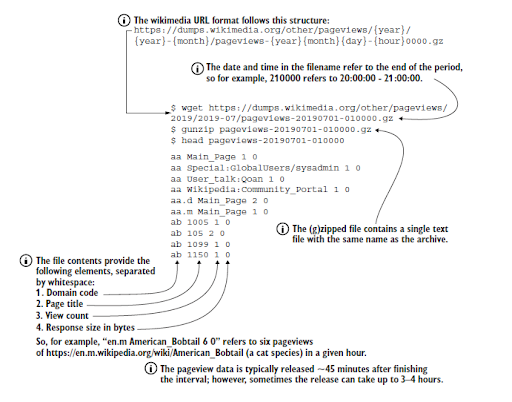

## Project Overview
This capstone project is designed to reinforce your understanding of Data Workflow Orchestration with Apache Airflow. The focus is on implementing a data pipeline that addresses data ingestion, processing, storage, and some other data engineering lifecycle stages. The project challenges you to apply your knowledge of Apache Airflow to solve a practical scenario based problem.

### Project Scenario Background:
You have been hired as a data engineer by a data consulting organization, who is looking at building a stock market prediction tool that applies sentiment analysis, called **LaunchSentiment**. To perform this sentiment analysis, they plan to leverage the data about the number of Wikipedia page views a company has.

**Wikipedia** is one of the largest public information resources on the internet. Besides the wiki pages, other items such as website pageview counts are also publicly available. To make things simple, they assume that an increase in a company’s website page views shows a positive sentiment, and the company’s stock is likely to increase. On the other hand, a decrease in pageviews tells us a loss in interest, and the stock price is likely to decrease.

### Data Source:
Luckily the needed data to perform this sentiment analysis is readily available. The Wikimedia Foundation (the organization behind Wikipedia) has provided all pageviews since 2015 in machine-readable format. The pageviews can be downloaded in gzip format and are aggregated per hour per page. 

Each hourly dump is approximately 50 MB in gzipped text files and is somewhere between 200 and 250 MB in size unzipped.

All pageviews data can be found here:
https://dumps.wikimedia.org/other/pageviews

The pageviews data for October, 2025 can be found here:
https://dumps.wikimedia.org/other/pageviews/2025/2025-10/

The structure and technical details of Wikipedia pageviews data is documented here: [structure](https://meta.wikimedia.org/wiki/Research:Page_view) and [technical](https://wikitech.wikimedia.org/wiki/Analytics/Data_Lake/Traffic/Pageviews) details.

### Sample Data Explanation:

### Project Tasks:
To start small, your manager has asked you to create the first version of a DAG pulling the Wikipedia pageview counts by downloading, extracting, and reading the pageview data for any one hour duration on any date in December 2025 (**e.g 4pm data for 10th of December, 2024**). 
To further streamline your analysis, you have been asked to select just five companies (**Amazon, Apple, Facebook, Google, and Microsoft**) from the data extracted in order to initially track and validate the hypothesis.

When you are done with the DAG development and you have successfully loaded the data into a database by running your data pipeline, then perform a simple analysis to show **which company’s page out of the 5 selected has the highest views** (You can write a simple SQL query to achieve this).
 
### Tasks Summary
Download and extract the zip file containing the pageviews data for just one hour, fetch the needed fields and pagenames only, load the fetched data into a database of your choice and do a simple analysis to get the company with the highest pageviews for that hour.

### Duration:
1 week 

### Deliverables:
- A data pipeline orchestrated with Apache Airflow
- Documentation of the design or architecture of the data pipeline, including the rationale behind key decisions and useful information.
- Include necessary best practices like failure alert, retries, idempotence, etc.
- The pipeline must be runnable.

### Mode of Submission:
A link to a Github repo containing your solution to be submitted

Submit using this form - https://forms.gle/DWSxpEDRebu8qJSw8

**Duration:** 7 days

**Deadline:** 17/12/2025

### Conclusion
By accomplishing this case study project, you will become more confident in data workflow orchestration with Apache Airflow. Give it your best shot and learn as much as possible along the process. Ask as many questions as needed and make Google your best friend.

**We wish you the best of luck.**
